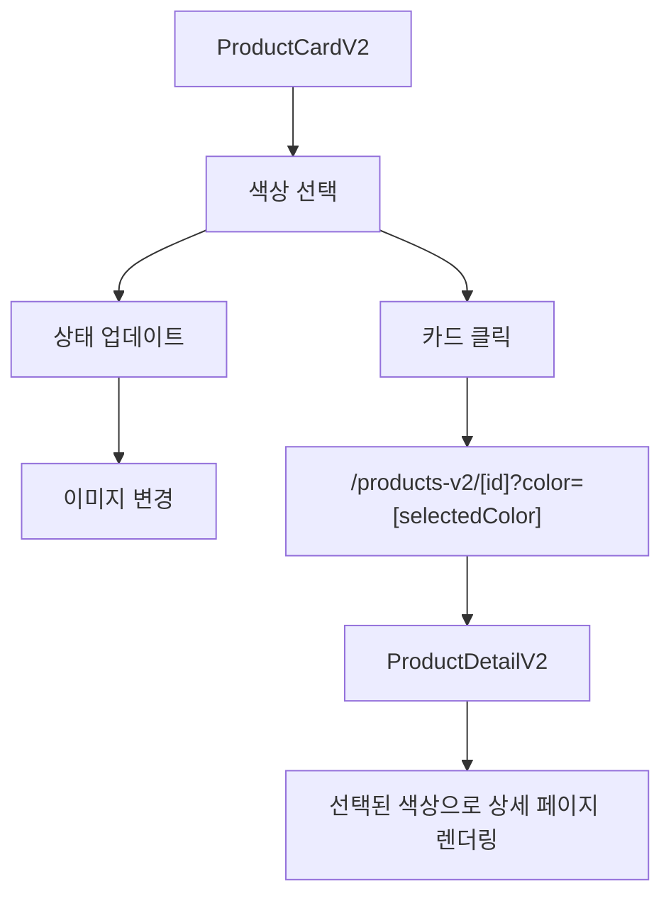

# 🔍 Product V2 Data Compatibility Analysis

## 📋 분석 개요

현재 시스템과 Product V2 요구사항 간의 데이터 호환성을 분석하여 연동성 문제점과 해결 방안을 제시합니다.

---

## 🚨 **주요 문제점 발견**

### ❌ **1. 이미지-색상 연결 시스템 부재**

#### **현재 상황**
```typescript
// 현재 BaseProduct 구조
interface BaseProduct {
  images?: string[];           // 단순 이미지 배열
  variants?: ProductVariant[]; // 옵션만 있고 이미지 연결 없음
}
```

#### **V2 요구사항**
```typescript
// 필요한 구조 (product-v2-example.txt 기반)
- 메인 이미지 (mainImage)
- 호버 이미지 (instagramImage) 
- 색상별 썸네일 이미지 (colorVariants[].thumbnail)
- 색상 선택 시 메인/호버 이미지 변경
```

#### **문제점**
1. **이미지-색상 매핑 없음**: 색상 선택 시 어떤 이미지를 보여줄지 알 수 없음
2. **호버 이미지 개념 없음**: 현재는 단일 이미지만 지원
3. **색상 썸네일 미지원**: ColorOption에는 swatchUrl만 있고 실제 상품 썸네일 없음

---

### ❌ **2. 상품 정보 매핑 불완전**

#### **현재 데이터**
```typescript
// products.ts의 실제 데이터
{
  name: "Modern Chair",
  description: "현대적인 디자인의 편안한 의자",
  category: "furniture"
}
```

#### **V2 요구사항**
```typescript
// product-v2-example.txt에서 요구하는 정보
- 가구 타입: "Original Modern", "Edge"
- 상품 설명: "Bookcase in White with Doors"  
- 정확한 치수: "103 x 243 cm"
- 색상명: "White", "Grey", "Brown"
```

#### **문제점**
1. **가구 타입 정보 없음**: 현재는 category만 있음
2. **색상명 누락**: variants의 options에는 있지만 메인 정보와 연결 안됨
3. **정확한 치수 정보 없음**: description에 포함되어야 하지만 구조화되지 않음

---

### ❌ **3. 상세 페이지 연동 불일치**

#### **현재 상세 페이지 구조**
```typescript
// ProductDetailClient.tsx
- 단순 이미지 표시 (product.images?.[0])
- variants 정보는 있지만 선택 기능 없음
- 색상 변경 시 이미지 연동 불가
```

#### **V2에서 필요한 연동**
```typescript
// V2 카드에서 선택된 정보를 상세 페이지에 전달
- 선택된 색상 정보
- 해당 색상의 이미지 세트
- 가격 정보 연동
- 구성기 연결
```

#### **문제점**
1. **색상 상태 전달 불가**: URL 파라미터로 색상 정보 전달 구조 없음
2. **이미지 동기화 불가**: 카드에서 선택한 색상과 상세 페이지 이미지 불일치
3. **변형 선택 인터페이스 부족**: 상세 페이지에서 색상 변경 불가

---

## ✅ **해결 방안**

### 🔧 **1. 확장된 ProductV2 데이터 모델**

```typescript
// 새로운 ProductV2 인터페이스
export interface ProductV2 extends BaseProduct {
  // 이미지 시스템
  mainImage: string;
  instagramImage: string;
  
  // 색상 변형 (이미지 포함)
  colorVariants: ColorVariantV2[];
  selectedVariant?: string;
  
  // 상품 세부 정보
  furnitureType: string;        // "Original Modern"
  exactDimensions: string;      // "103 x 243 cm"
  colorName: string;           // "White with Doors"
  
  // 라벨 및 배지
  labels?: ProductLabel[];
  badges: ProductBadge[];
}

// 확장된 색상 변형
export interface ColorVariantV2 {
  id: string;
  name: string;                // "White", "Grey"
  thumbnail: string;           // 썸네일 이미지
  mainImage: string;           // 해당 색상의 메인 이미지
  instagramImage: string;      // 해당 색상의 호버 이미지
  isSelected?: boolean;
  sku?: string;
  price?: Money;
}
```

### 🔧 **2. 데이터 마이그레이션 전략**

```typescript
// BaseProduct → ProductV2 변환 함수
export function convertToProductV2(base: BaseProduct): ProductV2 {
  return {
    ...base,
    // 임시 이미지 (실제 이미지 제공 전까지)
    mainImage: base.image || `/images/temp/${base.category}-main.jpg`,
    instagramImage: base.images?.[1] || `/images/temp/${base.category}-hover.jpg`,
    
    // 변형 정보에서 색상 추출
    colorVariants: base.variants?.map(variant => ({
      id: variant.id,
      name: variant.options.color || 'Default',
      thumbnail: `/images/temp/${base.category}-${variant.options.color?.toLowerCase()}-thumb.jpg`,
      mainImage: `/images/temp/${base.category}-${variant.options.color?.toLowerCase()}-main.jpg`,
      instagramImage: `/images/temp/${base.category}-${variant.options.color?.toLowerCase()}-hover.jpg`,
      sku: variant.sku,
      price: variant.price
    })) || [],
    
    // 메타데이터 생성
    furnitureType: generateFurnitureType(base.category),
    exactDimensions: generateDimensions(base.category),
    colorName: base.variants?.[0]?.options.color || 'Natural',
    
    // 배지 시스템
    badges: generateBadges(base),
    labels: generateLabels(base)
  };
}
```

### 🔧 **3. 상세 페이지 확장**

```typescript
// URL 구조 확장
// 현재: /products/[id]
// V2: /products-v2/[id]?color=[colorId]

// ProductDetailV2Client.tsx
export function ProductDetailV2Client({ 
  product, 
  selectedColorId 
}: {
  product: ProductV2;
  selectedColorId?: string;
}) {
  const [currentColor, setCurrentColor] = useState(
    selectedColorId || product.selectedVariant || product.colorVariants[0]?.id
  );
  
  // 선택된 색상에 따른 이미지 변경
  const currentVariant = product.colorVariants.find(v => v.id === currentColor);
  const displayImages = {
    main: currentVariant?.mainImage || product.mainImage,
    instagram: currentVariant?.instagramImage || product.instagramImage
  };
  
  // 색상 변경 핸들러
  const handleColorChange = (colorId: string) => {
    setCurrentColor(colorId);
    // URL 업데이트
    router.replace(`/products-v2/${product.id}?color=${colorId}`);
  };
  
  return (
    // 확장된 상세 페이지 UI
  );
}
```

---

## 🔄 **데이터 흐름 설계**

### **V2 카드 → 상세 페이지**


### **이미지 관리 시스템**
```typescript
// 이미지 세트 관리
interface ImageSet {
  main: string;        // 기본 이미지
  instagram: string;   // 호버 이미지  
  thumbnail: string;   // 썸네일 이미지
}

// 색상별 이미지 매핑
interface ColorImageMapping {
  [colorId: string]: ImageSet;
}

// 상품별 이미지 구조
interface ProductImages {
  default: ImageSet;
  variants: ColorImageMapping;
}
```

---

## 📊 **구현 우선순위**

### **Phase 1: 기본 구조 (High Priority)**
1. **ProductV2 타입 정의** ⚡
2. **데이터 변환 함수** ⚡
3. **임시 이미지 시스템** ⚡

### **Phase 2: 핵심 기능 (High Priority)**
1. **색상-이미지 연동** ⚡
2. **카드 상호작용** ⚡
3. **상세 페이지 확장** ⚡

### **Phase 3: 고급 기능 (Medium Priority)**
1. **실제 이미지 연동** 📷
2. **성능 최적화** 🚀
3. **상태 동기화** 🔄

---

## ⚠️ **위험 요소 및 대응**

### **1. 데이터 일관성**
- **위험**: 색상 선택과 이미지 불일치
- **대응**: 데이터 검증 및 폴백 이미지

### **2. 성능 이슈**
- **위험**: 많은 이미지 로딩으로 인한 성능 저하
- **대응**: Lazy loading + 이미지 최적화

### **3. 하위 호환성**
- **위험**: 기존 V1 시스템과의 충돌
- **대응**: 별도 네임스페이스 및 점진적 마이그레이션

---

## 🎯 **검증 체크리스트**

### **데이터 연동성**
- [ ] 색상 선택 시 메인/호버 이미지 정상 변경
- [ ] 썸네일 클릭 시 해당 색상으로 변경
- [ ] 카드에서 선택한 색상이 상세 페이지에 전달
- [ ] 상세 페이지에서 색상 변경 시 이미지 동기화

### **정보 표시**
- [ ] 가구 타입 정보 정확 표시
- [ ] 색상명 정확 표시  
- [ ] 치수 정보 정확 표시
- [ ] 가격 정보 정확 연동

### **페이지 전환**
- [ ] V2 카드에서 V2 상세 페이지로 올바른 이동
- [ ] URL 파라미터로 색상 정보 전달
- [ ] 브라우저 뒤로가기 시 상태 유지

---

**🔍 결론**: 현재 시스템은 V2 요구사항과 상당한 호환성 문제가 있으며, 확장된 데이터 모델과 새로운 컴포넌트 설계가 필요합니다. 위의 해결 방안을 단계적으로 구현하여 완전한 데이터 연동성을 확보해야 합니다.

---

*📅 분석 완료일: 2025-08-28*  
*📝 다음 단계: ProductV2 타입 정의 및 변환 함수 구현*